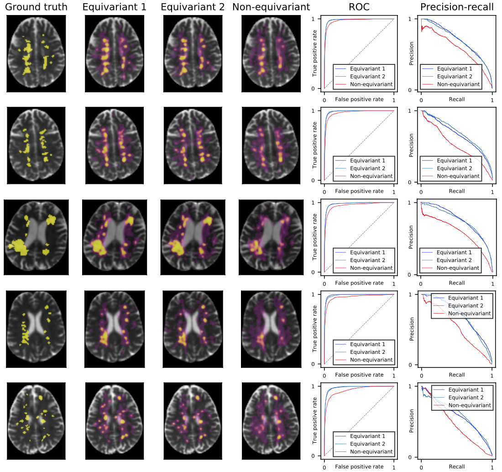
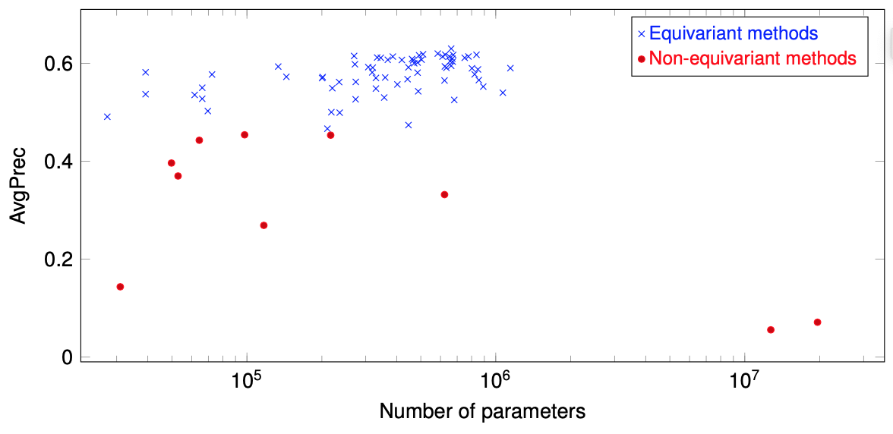
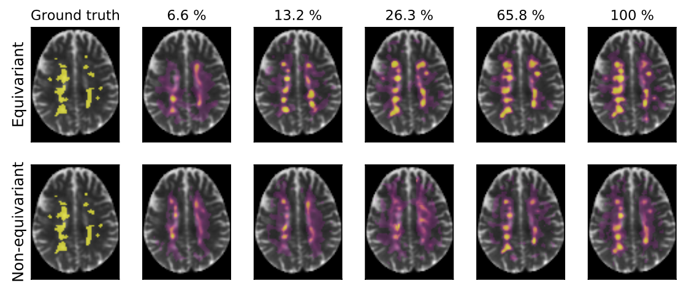
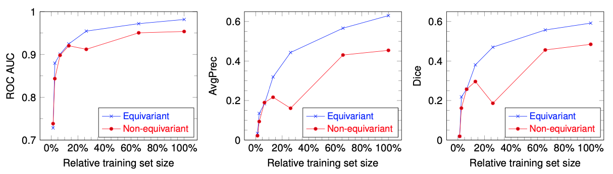

# Rotation-Equivariant Deep Learning for Diffusion MRI
Rotationally and translationally equivariant layers and networks for deep learning on diffusion MRI (dMRI) scans.

The related paper will be published soon, we will add the link here.
In this paper we showed that adding rotational equivariance to CNNs can improve the performance on prediction tasks
on dMRI scans. By publishing our code, we want to enable anyone to profit from the benefits of equivariance
as our layers can be used off the shelf without understanding the mathematical background.
So feel free to try our layers as a drop-in replacement of 3D CNN layers in any CNN architecture for dMRI.

Note that you should not use common nonlinearities (like ReLU) in combination with them, but use the provided nonlinearities (i.e. gated nonlinearities).
It might also hurt the performance to mix our roto-translationally equivariant layers with normal 3D CNN layers.
If you plan to mix them, we propose to use our equivariant layers (with gated nonlinearities) as the first
layers and apply normal 3D CNN layers (together with common nonlinearities like ReLU) afterwards.

Beside our layers, we also provide a simple roto-translationally equivariant neural network (based on our layers) 
for segmentation (i.e. voxel-wise predictions) of dMRI scans.

For examples on how to use the provided layers and network see the [example notenook](example.ipynb).

This repository includes:
- Rotationally and translationally equivariant linear layer (i.e. extension of convolutional layer, which is only translationally equivariant): [equidmri/layers/EquivariantPQLayer.py](equideepdmri/layers/EquivariantPQLayer.py)
- Rotationally and translationally equivariant neural network for voxel-wise predictions (e.g. segmentation) on diffusion MRI scans: [equidmri/network/VoxelWiseSegmentationNetwork.py](equideepdmri/network/VoxelWiseSegmentationNetwork.py)

## IMPORTANT: Requirements and Installation
Before installing the library ensure that python>=3.7, pytorch>=1.5 (we only tested v1.5) and cuda (if required) is installed.
Using `conda` this can be done with the following command:

    conda install pytorch==1.5.0 cudatoolkit=10.2 -c pytorch

The library can then be installed with the command:
        
    pip install git+https://github.com/philip-mueller/equivariant-deep-dmri.git

Alternatively you can use [this](environment.yml) environments file to setup a conda environment.

## Abstract
Convolutional networks are successful, but they have recently been outperformed by new neural networks 
that are equivariant under rotations and translations. These new networks work better because they do not struggle with learning
each possible orientation of each image feature separately. 
So far, they have been proposed for 2D and 3D data.
Here we generalize them to 6D diffusion MRI data, ensuring joint equivarianceunder 3D roto-translations in image space and the matching 3D rotations in q-space, as dictated by the image formation. 
Such equivariant deep learning is appropriate for diffusion MRI, because microstructural and macrostructural features such as neural fiberscan appear at many different orientations, and because even non-rotation-equivariant deep learning has so far been the best method for many diffusion MRI tasks.
We validate our equivariant method on multiple-sclerosis lesion segmentation. 
Our proposed neural networks yield better results and require fewer scans for training.
They also inherit all the advantages of deep learning over classical diffusion MRI methods.

## Results for Multiple-Sclerosis Lesion Segmentation on dMRI Scans
### Trained on Full Dataset

### Trained on Reduced Datasets (Subset of Training Samples)

